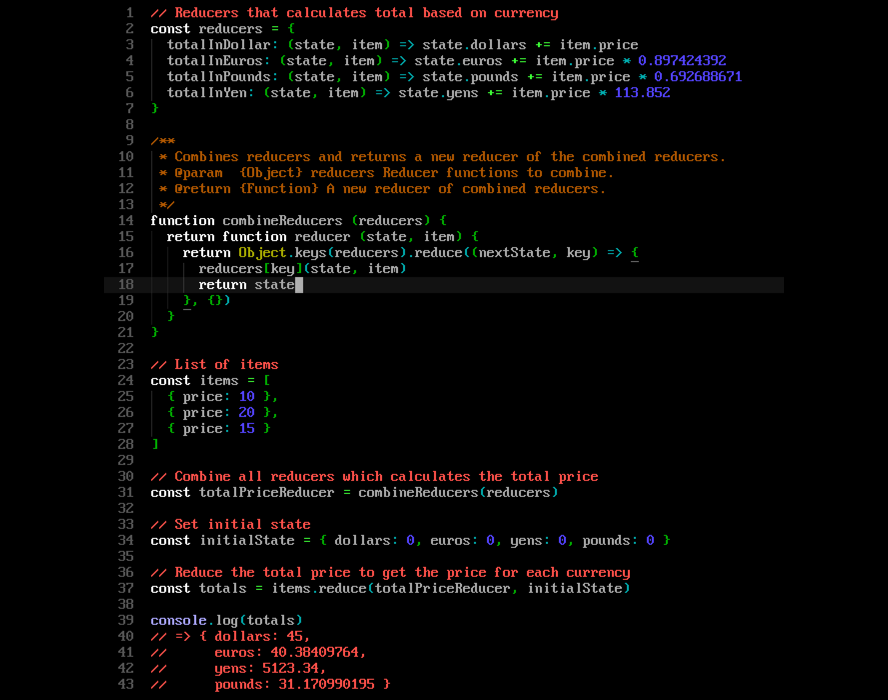

A color scheme for Sublime Text 3 using DOS CGA colors. Has great support for [Babel](https://packagecontrol.io/packages/Babel).

## Prerequesites

- [Package Control](https://packagecontrol.io/)

## Install

#### Package Control (Recommended)

1. Open Command Palette in Sublime Text.
2. Choose `Package Control: Install Package`.
3. Search for `DOS-CGA Color Scheme` and install.

#### Manually

[Download **DOS-CGA Color Scheme** from Releases](https://github.com/fnky/dos-cga-theme/releases) and extract to packages folder:

- **macOS**: `~/Library/Application Support/Sublime Text 3/Packages`
- **Windows**: ` %APPDATA%\Sublime Text 3\Packages`
- **Linux**: `~/.Sublime Text 3/Packages`

#### Git

Clone this repository into your packages folder, located at:

```
git clone https://github.com/fnky/dos-cga-theme "DOS-CGA Color Scheme"
```

## Preview



## Configuration

To enable the theme, put this in your Settings (`Preferences > Settings`):

```json
{
  "color_scheme": "Packages/DOS-CGA Color Scheme/DOS-CGA.tmTheme"
}
```

#### Recommended Configuration

This theme best fits with bitmap fonts like [Px437 fonts](http://int10h.org/oldschool-pc-fonts/).

Example configuration using `Px437 IBM VGA8` and block caret.

```json
{
  // Font settings
  "font_face": "Px437 IBM VGA8",
  "font_options":
  [
    "no_antialias"
  ],
  "font_size": 16,

  // Spacing
  "line_padding_bottom": 0,
  "line_padding_top": 0,
  "margin": 0,

  // Caret
  "wide_caret": true,
  "inverse_caret_state": true,
  "caret_extra_bottom": 0,
  "caret_extra_top": 0,
  "caret_extra_width": 0,
  "caret_style": "solid",
}
```

> **Note:** The block caret support in Sublime Text 3 is questionable at best and makes it hard to see the character under the caret, you can disable it by setting `inverse_caret_state` to `false`.

## License

[MIT LIcense](LICENSE)
